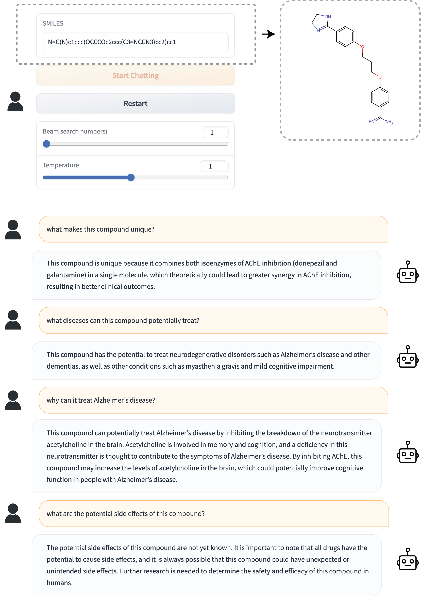
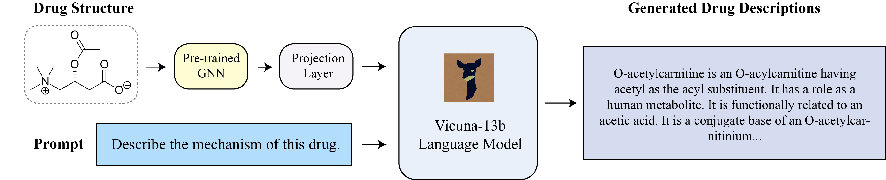

# DrugChat: Towards Enabling ChatGPT-Like Capabilities on Drug Molecule Graphs

This repository holds the code of DrugChat: Towards Enabling ChatGPT-Like Capabilities on Drug Molecule Graphs.


## Examples

 


## Introduction
- In this work, we make an initial attempt towards enabling ChatGPT-like capabilities on drug molecule graphs, by developing a prototype system DrugChat.
- DrugChat works in a similar way as ChatGPT. Users upload a compound molecule graph and ask various questions about this compound. DrugChat will answer these questions in a multi-turn, interactive manner. 
- The DrugChat system consists of a graph neural network (GNN), a large language model (LLM), and an adaptor. The GNN takes a compound molecule graph as input and learns a representation for this graph. The adaptor transforms the graph representation produced by the GNN  into another  representation that is acceptable to the  LLM. The LLM takes the compound representation transformed by the adaptor and users' questions about this compound as inputs and generates answers. All these components are trained end-to-end.
- To train DrugChat, we collected   instruction tuning datasets which contain 10,834 drug compounds and 143,517 question-answer pairs.




## Datasets

The file `data/ChEMBL_QA.json` and `data/PubChem_QA.json` contains data for the ChEMBL Drug Instruction Tuning Dataset and the PubChem Drug Instruction Tuning Dataset. The data structure is as follows. 

{SMILES String: [ [Question1 , Answer1], [Question2 , Answer2]... ] }


## Getting Started
### Installation
These instructions largely follow those in MiniGPT-4.

**1. Prepare the code and the environment**

Git clone our repository, creating a python environment and ativate it via the following command

```bash
git clone https://github.com/UCSD-AI4H/drugchat
cd drugchat
conda env create -f environment.yml
conda activate drugchat
```


**2. Prepare the pretrained Vicuna weights**

The current version of DrugChat is built on the v0 versoin of Vicuna-13B.
Please refer to our instruction [here](PrepareVicuna.md) 
to prepare the Vicuna weights.
The final weights would be in a single folder in a structure similar to the following:

```
vicuna_weights
├── config.json
├── generation_config.json
├── pytorch_model.bin.index.json
├── pytorch_model-00001-of-00003.bin
...   
```

Then, set the path to the vicuna weight in the model config file 
[here](pipeline/configs/models/drugchat.yaml#L16) at Line 16.

### Training
Start training the projection layer that connects the GNN output and the LLaMA model by running `bash finetune_gnn.sh`. 

### Inference by Launching Demo Locally
**To get the inference to work properly, you need to create another environment (`rdkit`) and launch a backend process which converts SMILES strings to Torch Geometric graphs.**

To create the `rdkit` environment and run the process, run
```
conda create -c conda-forge -n rdkit rdkit
conda activate rdkit
pip install numpy
python dataset/smiles2graph_demo.py
```
Then, the `smiles2graph_demo.py` will be running in the backend to serve the `demo.py`.

Find the checkpoint you obtain from the training process above, which is located under the folder `pipeline/output/pipeline_stage2_finetune/`. Copy it to the folder `ckpt` by running `cp pipeline/output/pipeline_stage2_finetune/the_remaining_path ckpt/with_gnn_node_feat.pth`.

Now we launch the `demo.py` in our original environment. Make sure you have run `conda activate drugchat`. Then, start the demo [demo.sh](demo.sh) on your local machine by running `bash demo.sh`. Then, open the URL created by the demo and try it out!


## Acknowledgement

+ [MiniGPT-4](https://minigpt-4.github.io/) This repo is based on MiniGPT-4, an awesome repo for vision-language chatbot!
+ [Lavis](https://github.com/salesforce/LAVIS)
+ [Vicuna](https://github.com/lm-sys/FastChat)


## License
This repository is under [BSD 3-Clause License](LICENSE.md).
Many codes are based on [MiniGPT-4](https://github.com/Vision-CAIR/MiniGPT-4) with BSD 3-Clause License [here](LICENSE_MiniGPT4.md), which is based on [Lavis](https://github.com/salesforce/LAVIS) with 
BSD 3-Clause License [here](LICENSE_Lavis.md).


## Disclaimer

This is a prototype system that has not been systematically and comprehensively validated by pharmaceutical experts yet. Please use with caution. 

Trained models and demo websites will be released after we thoroughly validate the system with pharmaceutical experts.


## Citation

If you're using DrugChat in your research or applications, please cite using this BibTeX:
```bibtex
@article{liang2023drugchat,
  title={DrugChat: Towards Enabling ChatGPT-Like Capabilities on Drug Molecule Graphs},
  author={Liang, Youwei and Zhang, Ruiyi and Zhang, li and Xie, Pengtao},
  journal={arXiv preprint arXiv:xxxx.xxxxx},
  year={2023}
}