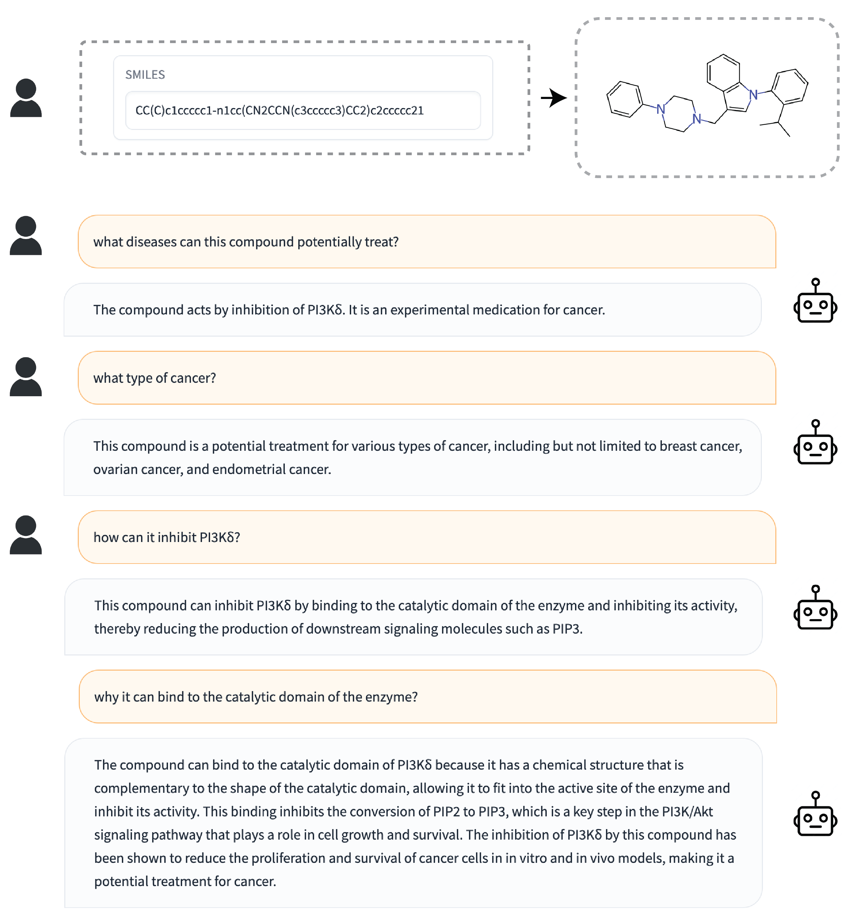

# DrugChat: Towards Enabling ChatGPT-Like Capabilities on Drug Molecule Graphs

This repository holds the code of DrugChat: Towards Enabling ChatGPT-Like Capabilities on Drug Molecule Graphs.

## Examples
  |   |   |
:-------------------------:|:-------------------------:
 |  

## Introduction
- In this work, we make an initial attempt towards enabling ChatGPT-like capabilities on drug molecule graphs, by developing a prototype system DrugChat.
- DrugChat works in a similar way as ChatGPT. Users upload a compound molecule graph and ask various questions about this compound. DrugChat will answer these questions in a multi-turn, interactive manner. 
- The DrugChat system consists of a graph neural network (GNN), a large language model (LLM), and an adaptor. The GNN takes a compound molecule graph as input and learns a representation for this graph. The adaptor transforms the graph representation produced by the GNN  into another  representation that is acceptable to the  LLM. The LLM takes the compound representation transformed by the adaptor and users' questions about this compound as inputs and generates answers. All these components are trained end-to-end.
- To train DrugChat, we collected   instruction tuning datasets which contain 10,834 drug compounds and 143,517 question-answer pairs.

## ChEMBL Drug QA Dataset

The file data/ChEMBL_QA.json contains data for the ChEMBL Drug QA Dataset. The data structure is as follows. 

{SMILES String: [ [Question1 , Answer1], [Question2 , Answer2]... ] }

## PubChem Drug Description Dataset

The file data/PubChem_Desc.json contains data for the PubChem Drug Description Dataset. The data structure is as follows:

[ [ Name, SMILES String, [Description 1, Description 2, ...] ], ... ]